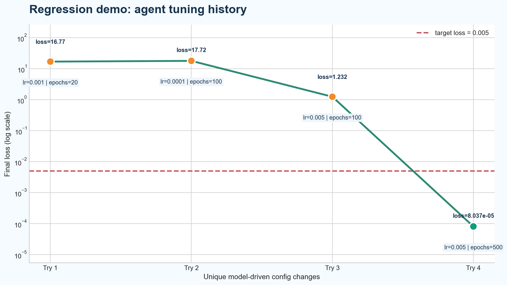

# Gemma_RA

Open-source research assistant and experiment loop for Gemma4 on Ollama.

Gemma_RA can read papers, search arXiv, synthesize literature, propose research directions, and execute constrained workspace experiments from a free-form `INSTRUCTIONS.md`.

## TL;DR

- Local-first research assistant powered by Gemma4 via Ollama
- Reads local PDFs and searches arXiv by professor name
- Produces structured outputs for summaries, reviews, ideas, and experiment plans
- Can run code, inspect logs, edit files, and iterate inside a constrained workspace
- Look at the demo where the agent tunes a regression task until it succeeds!

## Why This Is Fun

- `INSTRUCTIONS.md` as the interface: write what you want, let the agent choose tools
- Same runtime can do paper work and code work
- Tool use is constrained to a configured workspace root
- Outputs are both human-readable Markdown and machine-readable JSON
- Verbose mode lets you watch the loop think, call tools, run code, and react to logs

## First version Highlights

The bundled regression demo starts from a failing setup and lets the agent iterate until success:

- initial loss: `16.7727`
- final loss: `0.0000803726`
- final config: `learning_rate=0.005`, `epochs=500`
- success criterion: `final_loss <= 0.005`
- unique model-driven config attempts: `4`

That result came from the agent reading the code, running training, reading logs, changing hyperparameters, and rerunning until the target was met.



The chart above is generated from [examples/regression_task/logs/history.jsonl](examples/regression_task/logs/history.jsonl) after deduplicating repeated runs. It shows the agent trying:

- `lr=0.001, epochs=20`
- `lr=0.0001, epochs=100`
- `lr=0.005, epochs=100`
- `lr=0.005, epochs=500`

See the final run artifact in [examples/regression_task/logs/latest.json](examples/regression_task/logs/latest.json).

## What It Can Do

- Analyze a paper into problem, inputs, method, outputs, ideas, contributions, and limitations
- Review a topic from local papers or professor-based arXiv discovery
- Find recent papers from arXiv and explain why they matter
- Generate grounded research ideas from papers
- Suggest lightweight experiments to test those ideas
- Map a field end-to-end from seed professors and papers to novel opportunities
- Read `INSTRUCTIONS.md`, choose tools, run experiments, inspect logs, and keep iterating

## Project Layout

- `src/gemma_ra/cli.py`: CLI entrypoints
- `src/gemma_ra/agent`: orchestration and tool registry
- `src/gemma_ra/sources`: local PDF ingestion and arXiv search
- `src/gemma_ra/analysis`: tool loop, prompting, structured outputs, rendering
- `src/gemma_ra/core`: config, schemas, artifacts, model client, workspace executor, task specs
- `examples/regression_task`: runnable demo for autonomous hyperparameter tuning
- `examples/mnist_mlp_task`: harder torch MLP demo on synthetic MNIST-style digits
- `tests`: unit and integration-style tests

## Requirements

- Python 3.11+
- [uv](https://github.com/astral-sh/uv)
- [Ollama](https://ollama.com/)
- A local Gemma4 model available in Ollama

Example:

```bash
ollama pull gemma4
```

## Setup

```bash
uv venv
uv sync --extra dev
```

Default config in `gemma_ra.yaml`:

```yaml
ollama:
  host: "http://localhost:11434"
  model: "gemma4"
executor:
  workspace_root: "."
  max_iterations: 20
  command_timeout_seconds: 120
papers_dir: "./papers"
output_dir: "./outputs"
```

## Fastest Demo

Watch the agent tune a toy regression project until it succeeds:

```bash
uv run gemma-ra run-instructions \
  --instructions-file examples/regression_task/INSTRUCTIONS.md \
  --config examples/regression_task/gemma_ra.example.yaml \
  --verbose
```

What happens:

1. The agent reads [examples/regression_task/INSTRUCTIONS.md](examples/regression_task/INSTRUCTIONS.md)
2. It inspects the workspace files
3. It runs [examples/regression_task/train.py](examples/regression_task/train.py) with `uv run python`
4. It reads [examples/regression_task/logs/latest.json](examples/regression_task/logs/latest.json)
5. It edits [examples/regression_task/config.json](examples/regression_task/config.json)
6. It reruns until the target loss is achieved

Want a harder example with `torch` and a real neural network training loop?

```bash
uv pip install torch
uv run gemma-ra run-instructions \
  --instructions-file examples/mnist_mlp_task/INSTRUCTIONS.md \
  --config examples/mnist_mlp_task/gemma_ra.example.yaml
```

## CLI Examples

Analyze a local paper:

```bash
uv run gemma-ra analyze-paper --paper ./papers/example.pdf
```

Review a topic from local PDFs:

```bash
uv run gemma-ra review-topic --topic "graph representation learning" --papers-dir ./papers --verbose
```

Find papers by professor name on arXiv:

```bash
uv run gemma-ra find-papers --topic "computer graphics" --professor "Ali Mahdavi Amiri" --verbose
```

Generate research ideas, based on recent papers of a professor:

```bash
uv run gemma-ra generate-ideas --topic "small-model agents" --professor "Yejin Choi" --verbose
```

Suggest lightweight experiments:

```bash
uv run gemma-ra suggest-experiments --topic "retrieval-free literature agents" --papers-dir ./papers --verbose
```

Map a field in one run:

```bash
uv run gemma-ra map-research-opportunities --topic "computer vision" --professor "Daniel CohenOr" --papers-dir ./papers --verbose
```

Run a free-form instruction file:

```bash
uv run gemma-ra run-instructions --instructions-file ./INSTRUCTIONS.md --verbose
```

## Constrained Tooling

`run-instructions` can use constrained workspace tools to:

- list files under a configured workspace root
- read workspace files and logs
- write workspace files
- update JSON fields like hyperparameters
- run Python scripts through `uv run python`

These tools are intentionally limited to the configured workspace root, and the loop is capped by `executor.max_iterations`.

## Outputs

Each run writes:

- a Markdown artifact for humans
- a JSON artifact for downstream tooling

By default artifacts are stored under `./outputs`.

## Notes

- Ollama is the only model backend in v0.1.0
- Online paper discovery is arXiv-only for now
- Local PDF ingestion assumes text-extractable PDFs, not OCR
- arXiv API requests use `https://export.arxiv.org/api/query`
- The agent can execute iterative experiment loops, but only inside the configured workspace root

## Testing

```bash
uv run pytest
```
